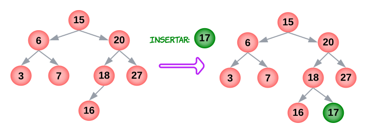

# TDA ABB

## Repositorio de Francisco Infanti - 110822 - finfanti@fi.uba.ar

- Para compilar:

```bash
make 
```

- Para ejecutar:

```bash
./pruebas_chanutron
```

- Para ejecutar con valgrind:
```bash
make valgrind-chanutron 
```
---
##  Funcionamiento

El programa consiste en la implementacion de un **ABB**, este es un tipo de árbol con todas sus características explicadas en el punto teórico. 

La implementación que se utilizó para crear este tipo de árbol consiste de dos estructuras. Una principal, `abb_t`, la cual almacena la dirección de memoria del primer nodo, la cantidad de elementos y un comparador proporcionado por el usuario. Este comparador me permitía mantener cierto orden en el arbol. 

La segunda estructura que se utilizó, `nodo_abb_t`, cumple la función de almacenar la dirección de memoria del elemento y del nodo de su izquierda y derecha. Es muy importante que si un nodo no tiene izquierda o derecha, que éste apunte a `NULL`. De este modo se sabrá si hay que seguir recorriendo por dicha rama.

El usuario puede almacenar los elementos que desee en el árbol, por dicho motivo es que hago uso de los `void*`, los cuales me permiten almacenar direcciones de memoria sin necesidad de saber que hay en dichas direcciones. Por este motivo es importante el comparador, pues yo no se como comparar los elementos que me ingresa el usuario.

Sabemos que la naturaleza de un arbol es recursiva, por lo tanto las funciones que requieran recorrer el arbol fueron implementadas de forma recursiva. Al hacerlo de esta forma, cada llamado a funcion se concentra en un unico nodo. Es decir, la primera vez que se llame a la funcion se creara un stackframe donde el problema es el primer nodo, luego cuando si se quiere ir por otra rama para acceder a otro nodo se llamara nuevamente a la funcion y se creara un nuevo stackframe donde el problema sera otro nodo diferente al del primero. 

---
<div align="center">

</div>

---
*(**COMENTARIO**: En esta implementación se permiten insertar elementos repetidos y se tomó la convención de mandarlos hacia la izquierda. A su vez, si queremos eliminar un elemento con dos hijos, se tomará el predecesor inorden para reemplazarlo. Tambien en el analisis de las complejidades de las operaciones, voy a suponer que el arbol esta balanceado. En el punto teorico se explicara que ocurre si no esta balanceado)*

Para poder crear un arbol lo que se hace es reservar un bloque de memoria en el heap de tamaño adecuado *(Para que pueda almacenar todo lo mencionado anteriormente)*. Se guardara la direccion de memoria del comparador y el resto de los campos de la estrcutura se inicializan en 0 o `NULL`, dependiendo si es un puntero. En el caso de que haya algún fallo en el proceso, ya sea que no se pueda reservar memoria o el comparador sea invalido, se devolverá `NULL`. 

Notemos que la complejidad de esta operación es constante $O(1)$, pues en el peor de los casos siempre se realizara la misma cantidad de operaciones.

---
<div align="center">

</div>

---
En el caso de que se termine de usar el árbol, este debe ser destruido. Para dicho objetivo se proporcionan dos funciones, ambas liberan toda la memoria que está siendo usada por el árbol, la diferencia es que una aplica una función destructora a cada elemento del árbol. Para poder implementar estas funciones decidí hacerlo implementando una función recursiva que recorre el árbol en **postorden** y va eliminando cada elemento del arbol y, si es necesario, aplica la funcion destructora. De este modo la eliminación es muy simple, pues el recorrido **postorden** da el camino mas optimo para eliminar un árbol.

La complejidad de destruir un árbol siempre será $O(n)$, pues ya sea el mejor o peor caso, siempre debemos recorrer los $n$ elementos que este tiene para así ir liberando la memoria de cada nodo.

---
<div align="center">

</div>

---
Para poder insertar un elemento en el arbol, se reserva un bloque de memoria en el heap de tamaño `nodo_abb_t`, en dicho bloque se almacenará el nuevo elemento que se quiere insertar, y a su vez los punteros a su hijo izquierdo y derecho, que en este caso son `NULL`.

Una vez que se reservo dicho bloque, se recorre el árbol de manera recursiva y se va comparando el elemento a insertar con los elementos que ya se encuentran en el árbol. Siguiendo la lógica de que si el elemento a insertar es mayor, comparamos con los elementos del subárbol derecho y sino con el del izquierdo, así hasta llegar al final del árbol (posición donde debe insertarse el elemento). Una vez en dicha posición hacemos que el ultimo nodo apunte, por derecha o izquierda, al nuevo nodo.

Veamos que la complejidad de insertar un elemento es $O(log(n))$, pues en el peor de los casos, el elemento se debe insertar en el ultimo nivel del arbol, entonces deberia bajar por toda una rama hasta llegar al ultimo nivel. Las operaciones de reapuntar punteros son constantes $O(1)$ y no aportan al tamaño del problema. 

---
<div align="center">

</div>

---
Para eliminar un elemento del árbol también se recorre de manera recursiva hasta encontrar el elemento que queremos eliminar y liberar la memoria que este ocupa. Durante este proceso se pueden dar dos casos diferentes:

- ***1ro.*** Si se está eliminando un elemento con un hijo o ninguno, se procede eliminando el elemento y haciendo que el padre del que queremos eliminar apunte al hijo del que estamos eliminando. Como sabemos que tiene como máximo un hijo, y si no tiene apunta a `NULL`, entonces no estaríamos rompiendo el arbol.

---
<div align="center">

</div>

---
- ***2do*** Si se esta eliminado un elemento con dos hijos, lo que se hace es buscar a partir del elemento que queremos eliminar el predecesor inorden, que vendría a ser la mayor cota menor. Una vez obtenemos dicho elemento, lo remplazamos por el cual queremos eliminar, haciendo que este apunte a los hijos del que vamos a eliminar y haciendo el padre de este apunte al predecesor. De esta manera se seguiría conservando el orden del árbol y no romperiamos el arbol. En el caso de que el predecesor tenga un hijo o ninguno, se procede como el primer caso.

---
<div align="center">

</div>

---
Para analizar la complejidad de eliminar con un o nigun hijo, es posible aplicar el **Teorema Maestro**, pues como mencione en el **COMENTARIO** estoy suponiendo que el arbol esta balanceado. 

Sabemos que la expresion a que resuelve dicho teorema es la siguiente:

$T(n) = a*T(n/b)+O(f(n))$, con $a \ge 1, b > 1, f(n) > 0$

En nuestro caso:
- $a = 1$ , pues solamente hacemos un llamdo recursivo dentro de la funcion.
- $b = 2$, pues luego de cada llamado a funcion el problema se divide a la mitad.
- $f(n) = \kappa$, pues separar el problema solamente debemos modificar la direccion de memoria a la que apunta un puntero.

Luego la expresion buscada nos queda de la siguiente manera: 

$\therefore T(n) = 1*T(n/2) + O(1) = T(n/2) + O(1)$

Veamos que $log_b(a) = log_2(1) = 0 => n⁰$ y ademas $f(n) = \kappa n⁰$. Por lo tanto como $n⁰ = f(n) => T(n) = O(n⁰*log(n)) = O(log(n))$, podemos concluir que eliminar un elemento con hijos o ninguno tiene una complejidad de $O(log(n))$.

Ahora veamos que para cuando queremos eliminar un elemento con dos hijos, el peor de los casos seria eliminar un elemento que esta en el medio del arbol. Pues debemos recorrer por una rama hasta el nodo que queremos eliminar, $log(n)$, y despues buscar su predecesor inorden, $log(n)$, Pero al final nos va a terminar quedando que $T(n) = log(n) + log(n) = 2log(n)$  que finalmente para **Big-O** esto es $O(log(n))$. Las operaciones de reapuntar punteros y liberar memoria son constantes $O(1)$ y no aportan al tamaño del problema.

Observemos que para ambos casos de eliminacion, si el arbol esta balanceado, la complejidad es $O(log(n))$.

Para buscar un elemento de un árbol, debemos recorrer el árbol comparando el elemento que buscamos con el nodo sobre el cual estamos parados, si el que buscamos es mas grande nos quedamos con el subárbol de la derecha y sino el de la izquierda. En el caso de que el elemento que se esté buscando no exista, se devolverá `NULL`. Veamos que es muy similar al proceso de insertar y eliminar, solamente que hacemos cosas diferentes cuando llegamos al nodo que buscamos.

La complejidad de esta operacion es $O(log(n))$, pues en el peor de los casos, el elemento que buscamos no existe y tuve que recorrer el arbol hasta el ultimo nivel. Pero como cada vez que bajaba por una rama, estaba descartando otra, el problema se fue disminuyendo a la mitad.

También se proporciona una función para saber el tamaño del árbol y si este está vacío. Ambas operaciones tienen complejidad constante $O(1)$, pues solamente estamos accediendo a un valor en un bloque de memoria sobre el cual tenemos un puntero directo, que vendría a ser el puntero al `árbol`.

El usuario también puede hacer uso de un iterador interno. Este funciona recorriendo los elementos del árbol y aplicando la función proporcionada, los posibles recorridos del arbol son **preorden**, **inorden** o **postorden**. La función al ser de tipo `bool`, puede indicar cuándo debe dejarse de recorrer el arbol. Una vez se terminado el recorrido, se devuelve la cantidad de elementos a la cual fue posible aplicarles la función. 

Veamos que la complejidad del iterador es $O(n)$, pues en el peor de los casos debo recorrer todo el árbol y sea cual sea el recorrido, se debe vistar todos los nodos.

Por último el usuario tambien puede hacer uso de una función la cual le permite cargar la cantidad de elementos que quiera del árbol en un array. Como en el iterador interno, el árbol se recorre en **preorden**, **inorden** o **postorden**. 

A su vez la complejidad, en el peor de los casos, es $O(n)$, pues ocurria lo mimso que con el iterador.

## Respuestas a las preguntas teóricas
Un árbol es un tipo de dato abstracto **(TDA)**. Se dice que este es una colección de nodos, en la cual un nodo puede apuntar a $n$ nodos, pero solamente puede ser apuntado por uno y además ningún nodo puede apuntar a la `raíz` del árbol. En el caso de que esto no se cumpla dejaria de ser un arbol y pasaria a ser un grafo. Que un nodo apunte a `NULL`, indica que este no tiene más nodos debajo de él y esto nos permite tener una condición de corte cuando estamos recorriendo un árbol.

La idea general de porqué se crean los árboles, es porque cuando nosotros tenemos una lista simplemente enlazada o doblemente enlazada, el tiempo de búsqueda de un elemento en el peor de los casos es $O(n)$, en cambio con la implementación de un árbol veremos que el tiempo de ejecucion pasa a ser $O(log(n))$. 

El nodo principal del árbol se lo conoce como la `raíz`, por este nodo será donde se entra si se quiere hacer alguna operación con el árbol. El árbol puede o no estar dividido en subárboles, pero cada subárbol de alguna manera debe estar conectado con la `raíz`. Algunas definiciones comunes de los árboles son las siguientes:

- Se dice que un nodo es `padre`, cuando éste apunta a otros nodos.
- Se dice que un nodo es `hijo`, cuando tiene un padre, es decir, cuando es apuntado por un nodo.
- Se dice que un nodo es una `hoja`, si es que este no tiene hijos.
- Se puede dividir a un árbol según sus `niveles`, siendo el 1er nivel el de la `raíz` y aumentando hacia abajo.
- La `altura` de un árbol se representa según la cantidad de niveles que este tiene y esta se puede calcular de la siguiente forma:

  - Si la cantidad de elementos de un arbol se calcula como: $\zeta = 2^\psi-1$ siendo $\psi$ los niveles del arbol, entonces operando algebraicamente obtenemos que la cantidad de niveles se calcula como $log_2(\zeta+1)$.

  $\zeta = 2^\psi-1 => \zeta+1 = 2^\psi => log_2(\zeta+1) = log_2(2^\psi) => log_2(\zeta+1) = \psi$

---
<div align="center">

</div>

---
Las operaciones que se definen sobre los arboles son: *crear*, *destruir*, *insertar*, *eliminar*, *buscar*, *recorrer* y *vacio*.  Tambien existen diferentes tipos de árboles, los *Árboles N-Arios*, *Arboles Binarios*, *Árboles Binarios de Búsqueda* **(ABB)**, *Árboles de Rotación* **(AVL)**, etc...

En mi caso solamente voy a explicar qué son los *Arboles N-Arios*, *Arboles Binarios* y los **ABB**. Primero empezare con los *N-Arios*, luego los *Binarios* y por ultimo los **ABB**. En cada uno de estos arboles voy a analizar las operaciones mencionadas. Algunas de estas son iguales (si tomamos la misma implementacion) en los tres tipos de arboles, por ejemplo: *crear*, *destruir*, *vacio*. 

- La complejidad de *crear* seria de $O(1)$, porque en el peor siempre estamos realizando la misma cantidad de operaciones. Que vendrian a ser reservar un bloque de memoria en el heap usando `malloc()` o `calloc()`.
- La complejidad de *destruir* siempre va a ser $O(n)$, pues si reservamos $n$ bloques de memoria para $n$ elementos del arbol, debemos liberar $n$ bloques.
- La complejidad de *vacio* depende de la implementacion que se tome. Si se tiene como informacion la cantidad de elementos que hay en el arbol, su complejidad sera $O(1)$, pues deberiamos ir a ver el valor de una variable. Ahora, si no tenemos un contador de elementos, una forma de determinar si esta vacio es recorrer el arbol e ir contabilizando los elementos sobre los cuales pasamos. En este caso, en el peor de todos, deberia recorrer los $n$ elementos para decir que no esta vacio, entonces su complejidad seria $O(n)$.

Antes de comenzar a explicar, quiero mencionar que son los recorridos. Estos, como dice el nombre, nos permite recorrer el árbol. Todos los recorridos comienzan en la `raíz` del árbol y constan de tres operaciones. Se dice que un nodo fue recorrido cuando se visita su contenido **(N)**, hijo derecho **(D)** e hijo izquierdo **(I)**. La complejidad que tienen todos los recorridos es $O(n)$, pues si en nuestro árbol tenemos $n$ elementos, debemos recorrerlos todos.

Los arboles *N-Arios* permiten que un nodo tenga $n$ hijos. En este tipo de arbol, la complejidad de *insertar*, *eliminar* y *buscar* dependen. Dependen de la condiciones que me den acerca del arbol, es decir, alguna relacion entre los elementos para poder buscarlos. Pues de no ser asi, se podria insertar un elemento en cualquier posicion y buscarlo, ya sea para eliminarlo o para saber si existe, puede llegar a tener una complejidad $O(log(n))$. 

---
<div align="center">

</div>

---
Los arboles *Binarios* surgen con el objetivo de aproximarnos a la búsqueda binaria. Estos establecen que un nodo solo puede tener entre $0 \le n \le 2$ hijos, luego esto nos permite dar una noción de izquierda y derecha dentro del árbol. Es decir, si estamos parados en un nodo, podemos ir a la izquierda o la derecha. 

---
<div align="center">

</div>

---
En este caso, tambien la complejidad de *insertar*, *eliminar* y *buscar* dependen de las condiciones que me den acerca del arbol, porque si no buscar un elemento en el arbol puede llegar a tener una complejiad $O(n)$. Ademas *insertar* un elemento, tambien puede que sea $O(n)$ o $O(log(n))$, todo depende de la relacion que haya con los elementos dentro del arbol.

Existen en total una cantidad de $3!$ de recorridos, pero los que explicare serán los siguientes: **preorden**, **inorden** y **postorden**

---
<div align="center">

</div>

---
- La primera operación que se realiza en el recorrido *preorden* es visitar el contenido que tiene el nodo, luego se debe ir hacia la izquierda de dicho nodo y por último a la derecha, **NID**. Este recorrido suele ser utilizado para copiar un árbol en otro.
- En el recorrido *inorden* lo primero que se hace es ir hacia la izquierda del nodo, luego se visita su contenido y por último se va hacia la derecha, **IND**. Este recorrido suele ser utilizado para recorrer el árbol en orden.
- Por último en el recorrido *postorden* lo primero que se hace es ir hacia la izquierda, luego la derecha y por último se visita el contenido del nodo, **IDN**. Este recorrido nos da el camino más óptimo para poder eliminar un árbol.

---
En cuanto a los **ABB**, estos son un tipo de *Arboles Binarios*, los cuales cumplen con un orden determinado. Cada nodo tiene una clave, con la cual se comparará con las claves de los otros nodos. Dicha comparación nos permite mantener un cierto orden a la hora de realizar operaciones con el árbol. 

*(**COMENTARIO**: En este caso mencionare las complejidades que tienen las operaciones, pero para no repetir informacion, no explicare detalladamente como se obtienen dichas complejidades. Estas estan explicadas en el funcionamiento del programa)*

---
<div align="center">

</div>

<div align="center"><font size="2">
En el dibujo las claves mayores estarían en el subárbol derecho y las menores en el subárbol izquierdo
</font></div>

---
- La operación de *insertar* un elemento en el árbol, consiste en que debemos recorrer el árbol e ir comparando el elemento que queremos insertar con las claves de los nodos del árbol. El resultado de dicha comparación determinará de qué lado del árbol debemos insertar el elemento. Dicha operacion tiene una complejidad $O(log(n))$

  ---
  <div align="center">
  
  </div>

  <div align="center"><font size="2">
  Comparamos con la raíz y vemos que el elemento a insertar es más grande, entonces lo "mandamos" para el subárbol derecho. Nuevamente hacemos la misma comparación con la "raíz" del subárbol derecho. Hasta finalmente encontrar la posición donde debemos insertarlo.
  </font></div>

  ---
- En cuanto a la operación de *eliminar* un elemento de un árbol, se pueden dar tres situaciones diferentes. A pesar de que se prodeca de otra forma, la complejidad total de eliminar es $O(log(n))$:

  - Eliminar un nodo `hoja`.
  <div align="center">
  
  </div>

  <div align="center"><font size="2">Lo que se hace es buscar el elemento que se quiera eliminar y quitarlo del árbol</font></div>

  ---
  - Eliminar un nodo con un `hijo`.
  <div align="center">
  
  </div>

  <div align="center"><font size="2">Se busca el elemento recorriendo el árbol. Una vez que se lo encuentra se debe hacer que al anterior a el apunte al hijo del que queremos eliminar. Una vez hecho eso podemos eliminar el nodo</font></div>

  ---
  - Eliminar un nodo con dos `hijos`.
  <div align="center">
  
  </div>

  <div align="center"><font size="2">Una vez encontramos el elemento que queremos eliminar, debemos encontrar el predecesor o el sucesor de este. El predecesor sería la mayor cota menor y el sucesor la menor cota superior. Luego debemos reemplazar el elemento que queremos eliminar por el predecesor o el sucesor. En el caso de que tengan un hijo, se procede como cuando queremos eliminar un elemento con un hijo. Es muy importante que se tome una convención según cual tomamos y mantener dicha convención para siempre</font></div> 

  ---
- Para *buscar* un elemento en el árbol debemos ir comparando el elemento que buscamos con la clave del nodo. Como en el proceso de insertar, esta comparación determina de qué lado del árbol debemos buscar el elemento. La complejidad de esta operacion es $O(log(n))$, al igual que la busqueda binaria.

---
<div align="center">

</div>

---
- Los *recorridos* que se pueden hacer en un **ABB** son los mismo que los recorridos que los de un *Arbol Binario*.

Para analizar la complejidad de las operaciones de un **ABB**, debemos tener en cuenta si el arbol esta balanceado o no. Que un árbol esté balanceado implica que este no se degenera en una lista. En el caso de que el árbol se degenere en una lista las complejidades de las operaciones pasarían a ser `O(n)`, pues no estaríamos partiendo el problema a la mitad, sino que descartando un elemento del arbol.

---
  <div align="center">
  
  </div>
  <div align="center"><font size="2">Veamos que en este caso si queremos buscar o eliminar el elemento 23, deberíamos recorrer el árbol como si fuera una lista. También ocurriría lo mismo si quisiéramos insertar un elemento mayor a 15</font></div> 

---
Para solucionar este tipo de problemas se introducen las rotaciones.