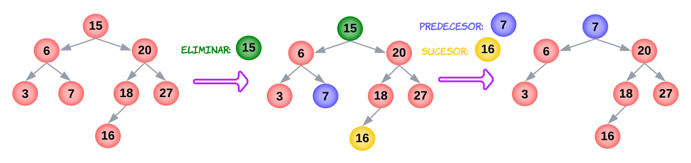

# TDA ABB

## Repositorio de Francisco Infanti - 110822 - finfanti@fi.uba.ar

- Para compilar:

```bash
make 
```

- Para ejecutar:

```bash
./pruebas_alumno
```

- Para ejecutar con valgrind:
```bash
make valgrind-chanutron 
```
---
##  Funcionamiento

--- 

<div align="center">

</div>

---

## Respuestas a las preguntas teóricas

Un arbol es un tipo de dato abstracto **(TDA)**. Se dice que este es una coleccion de nodos, que a su vez, pueden estar conectados a otros nodos. Un nodo puede apuntar a `n` nodos, pero solamente puede ser apuntado por uno. Ademas nigun nodo apunte a la `raiz` del arbol, en el caso de que eso ocurra dejaria de ser un arbol. Que un nodo apunte a `NULL`, indica que este no tiene mas nodos debajo de el. Esto nos permite tener una condicion de corte cuando estamos recorriendo un arbol.

La idea general de porque se crean los arboles, es porque cuando nosotros tenemos una lista simplemente enlazada o doblemente enlazada, el tiempo de busqueda de un elemento en el peor de los casos es `O(n)`, en cambio con la implementacion de un arbol veremos que en algunos casos esto el tiempo puede llegar a ser `O(log(n))`.

Las operaciones que se definen sobre los arboles son las siguientes: **Crear**, **Destruir**, **Insertar** **Eliminar**, **Buscar**, **Recorrer** y **Vacio**.

- La operacion de **Crear**, como lo dice el nombre, consiste en crear un arbol. Tambien la operacion de **Destruir** consiste en destruir todo el arbol y por ultimo la operacion de **Vacio**, nos permite saber si un arbol tiene elementos o no. Las operaciones de **Insertar**, **Eliminar**, **Recorrer** y **Buscar** dependen del arbol que se este implementando. Explicare estas en detalle en los *Arboles Binarios* y **ABB**.

---

<div align="center">

</div>


El nodo principal del arbol se lo conoce como la `raiz`, por este nodo sera donde se entra si se quiere hacer alguna operacion con el arbol. El arbol puede o no estar dividido en subarboles, pero cada subarbol de alguna manera debe estar concetado con la `raiz`. Algunas definiciones comunes de los arboles son las siguientes:

- Se dice que un nodo es `padre`, cuando este apunta a otros nodos. 
- Se dice que un nodo es `hijo`, cuando tiene un padre, es decir, cuando es apuntado por un nodo. 
- Se dice que un nodo es una `hoja`, si es que este no tiene hijos.
- Se puede dividir a un arbol segun sus `niveles`, siendo el 1er nivel el de la `raiz` y aumentando hacia abajo.
- La `altura` de un arbol se representa segun la cantidad de niveles que este tiene.

Existen diferentes tipos de arboles, los *Arboles Binarios*, *Arboles Binarios de Busqueda* **(ABB)**, *Arboles N-Arios*, *Arboles de Rotacion* **(AVL)**, etc...

En mi caso solamente voy a explicar que son los *Arboles Binarios* y los **ABB**. Como los **ABB** son un tipo de los *Aboles Binarios*, conviene primero explicar que es un *Arbol Binario*. Estos, como lo dice el nombre, son un arbol que surgen con la idea de aproximarnos a la busqueda binaria. En este tipo de arbol un nodo puede tener como maximo dos `hijos`. Esto nos permite dar una nocion de izquierda y derecha dentro del arbol. Es decir, si estamos parados en un nodo, podemos ir para la izquierda o par la derecha.

---

<div align="center">

</div>

---
Para los *Arboles Binarios* se definen una serie de recorridos, lo cual como dice el nombre, nos permite recorrer el arbol. Todos los recorridos comienzan en la `raiz` del arbol y constan de tres operaciones. Se dice que un nodo fue recorrido cuando se visita su contenido **(N)**, hijo derecho **(D)** e hijo izquierdo **(I)**. La complejidad que tienen todos los reocorridos es `O(n)`, pues si en nuestro arbol tenemos `n` elementos, debemos recorrelos todos.

Existen en total una cantidad de `3!` de reocorridos, pero los que explicare seran los siguientes: **Preorden**, **Inorden** y **Postorden**.

---

<div align="center">

</div>


- La primera operacion que se realiza en el recorrido *Preorden* es visitar el contenido que tiene el nodo, luego se debe ir hacia la izquierda de dicho nodo y por ultimo a la derecha, **NID**. Este recorrido suele ser utilizado para copiar un arbol en otro.
- En el recorrido *Inorden* lo primero que se hace es ir hacia la izquierda del nodo, luego se visita su contenido y por ultimo se va hacia la derecha, **IND**. Este recorrido suele ser utilizado para recorrer el arbol en orden.
- Por ultimo en el recorrido *Postorden* lo primero que se hace es ir hacia la izquierda, luego la derecha y por ulltimo se visita el contenido del nodo, **IDN**. Este recorrido nos da el camino mas optimo para poder eliminar un arbol. 

Notemos que el tiempo de ejecucion para los recorridos siempre sera `O(n)`, pues siempre estamos recorriendo los `n` elementos del arbol.

---
En cuanto a los **ABB**, estos son un tipo de *Arboles Binarios*, los cuales cumplen con un orden determinado. Cada nodo tiene una clave, con la cual se comparara con la claves de los otros nodos. Dicha comparacion nos permita mantener un cierto orden a la hora de realizar operaciones con el arbol.

---

<div align="center">

</div>

<div align="center"><font size="2">
En el dibujo las claves mayores estarian en el subarbol derecho y las menores en el subarbol izquierdo
</font></div>

---
- La operacion de *insertar* un elemento en el arbol, debemos recorrer el arbol e ir comparando el elemento que queremos insertar con las claves de los nodos del arbol. El resultado de dicha comparacion determinara de que lado del arbol debemos insertar el elemento. 

  ---
  <div align="center">
  
  </div>

  <div align="center"><font size="2">
  Comparamos con la raiz y vemos que el elemento a insertar es mas grande, entonces lo "mandamos" para el subarbol izquierdo. Nuevamente hacemos la misma comparacion con la "raiz" del subarbol izquierdo. Hasta finalmente encontrar la poscion donde debemos insertarlo.
  </font></div>

  ---
     Veamos entonces que la complejidad de insertar un elemento en un arbol es `O(log(n))`. Pues siempre que hacemos una comparacion, estamos quedandonos con la mitad del problema.

- En cuanto a la operacion de *eliminar* un elemento de un arbol, se pueden dar tres situaciones diferentes:

  - Eliminar un nodo `hoja`.
  <div align="center">
  
  </div>

  <div align="center"><font size="2">Lo que se hace es buscar el elemento que se quiera eliminar y quitarlo del arbol</font></div>

  ---
  - Eliminar un nodo con un `hijo`.
  <div align="center">
  
  </div>

  <div align="center"><font size="2">Se buscar el elemento recorriendo el arbol. Una vez que se lo encuentra se debe hacer que al anterior a el apunte al hijo del que queremos eliminar. Una vez hecho eso podemos eliminar el nodo</font></div>

  ---
  - Eliminar un nodo con dos `hijos`.
  <div align="center">
  
  </div>

  <div align="center"><font size="2">Una vez encontramos el elemento que queremos eliminar, debemos encontrar el predecesor o el sucesor de este. El predecesor seria la mayor cota menor y el sucesor la menor cota superior. Luego debemos remplazar el elemento que queremos eliminar por el predecesor o el sucesor. En el caso de que el predecesor o sucesor tenga un hijo, se procede como cuando queremos eliminar un elemento con un hijo. Es muy importante que se tome una convencion segun si tomamos el predecesor o el sucesor y mantener dicha convencion para siempre</font></div> 

  ---
  Tambien veamos que en este caso la complejidad de eliminar un elemento es `O(log(n))`, pues el proceso mas costoso de todo seria encontrar el elemento que queremos eliminar y como sabemos de la insercion, este proceso es `O(log(n))`. El resto de las operaciones de eliminar tienen una complejidad constante `O(1)`, pues solamente estamos reapuntando punteros.

- Para *buscar* un elemento en el arbol debemos ir comparando el elemento que buscamos con la clave del nodo. Como en el proceso de insertar, esta comparacion determinara de que lado del arbol debemos buscar el elemento. Veamos que esta operacion tiene una complejidad `O(log(n))`, pues al igual que *insertar* y *eliminar*, lo que hacemos es a medida que comparamos nos quedamos con un subarbol.
- Los *recorridos* que se pueden hacer en un **ABB** son los mismo que los recorridos que los de un *Arbol Binario*.

Para analizar la complejidad de estas operaciones en un **ABB** se asumio que el arbol estaba balanceado. Que un arbol este balanceado implica que este no se degenera en una lista. En el caso de que el arbol se degenere en una lista las complejidades de las operaciones pasarian a ser `O(n)`, pues no estariamos partiendo el problema a la mitad.

---
  <div align="center">
  
  </div>
  <div align="center"><font size="2">Veamos que en este caso si queremos buscar o eliminar el elemento 23, deberiamos recorrer el arbol como si fuera una lista. Tambien ocurriria lo mismo si quisieramos insertar un elemento mayor a 15.</font></div> 

---
Para solucionar este tipo de problemas se introducen las rotaciones.